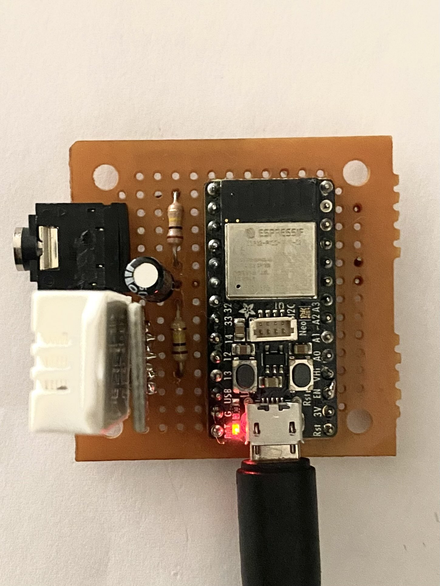
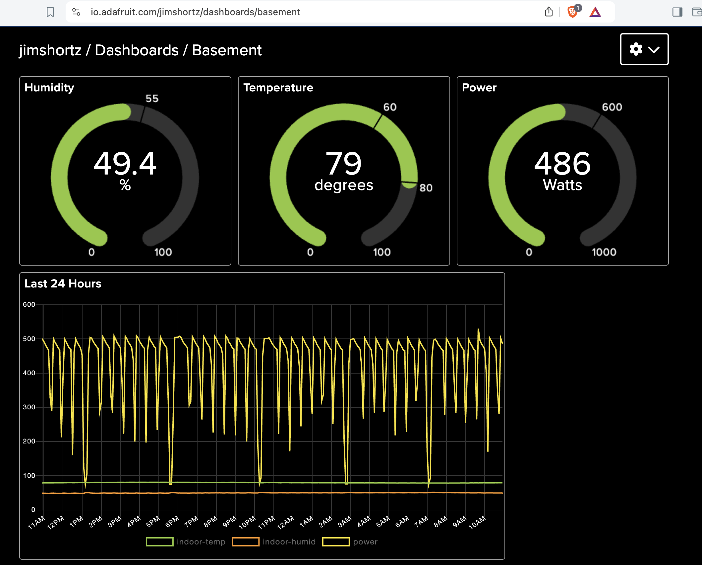

# ESP32/Arduino humidity, temperature, and power sensor.

## Description

This project implements a simple, low-cost environmental monitoring
system.  It senses temperature and humidity and power consumption.
These values are reported at regular intervals using the MQTT
protocol.

I designed this system to monitor conditions in my basement.  The power
monitor is used to measure power consumed by a dehumidifer unit.

## Prerequisites

To use this, you will need:

* A sensor board (see [kicad](kicad/README.md) directory for details)
* A USB power source.  Phone chargers are an easy choice.
* A snap-on current transformer (20A=1V) with built-in swamping resistor.  [Example](https://www.amazon.com/gp/product/B01MTTL6EZ/ref=ppx_yo_dt_b_search_asin_title?ie=UTF8&psc=1). (optional)
* Access to an MQTT broker (such as [Adafruit IO](https://io.adafruit.com))

## Setting it up
1. Connect the sensor board to a computer via USB
1. Open a serial terminal at 115200 bps, 8-N-1
1. Press the reset button
1. If the sensor does not immediately enter configuration mode, hit `C`
1. Go through the menu and set appropriate items
1. Hit `0` to exit configuration mode

Example:
```
Temperature/Humidity/Power Sensor v2.0 (C) 2021 - by Jim Shortz
Current settings:
    1. WiFi SSID (jimwifi)
    2. WiFi Password (*************)
    3. MQTT Client ID (basement)
    4. MQTT Host (io.adafruit.com)
    5. MQTT Port (1883)
    6. MQTT Username (jimshortz)
    7. MQTT Password (********************************)
    8. Humidity Topic (jimshortz/feeds/test_humid)
    9. Temperature Topic (jimshortz/feeds/test_temp)
    10. Power Topic (jimshortz/feeds/test_power)
    11. Humidity Calibration (0.00)
    12. Temperature Calibration (0.00)
    13. Reporting Interval (seconds) (15)
Press C to edit configuration
```

## Gallery





## Legal Stuff

This software comes with no warranty whatsoever.  Use it at your own
risk.  The author places no restrictions on redistribution, including
commercial applications.
