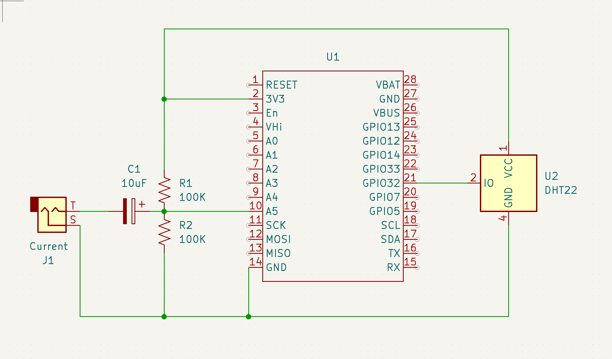

# How To Build Your Sensor

## Materials Needed
* ESP32 development board [Adafruit 5889](https://www.adafruit.com/product/5889)
* DHT22 temperature sensor
* Perfboard to hold components
* 2x100K resistors (optional)
* 10uF capacitor (optional)
* 1/8" phone jack (optional)

The latter 3 components are only needed if doing power monitoring and may
depend on the current transformer in use.

## Instructions
1. Mount components on perfboard as desired
2. Wire together according to [Schematic](../media/schematic.pdf)
3. Program board (see [Firmware](../README.md)

## Theory of Operation
This is a very simple circuit.  Most of it is contained on the ESP32 board
itself, including the power supply details.  The DHT22 is connected to the
power rails and uses one single GPIO port to communicate with the ESP.

The power monitoring circuit uses a transformer wrapped around the
power lead of the device being monitored.  This induces a small
current in the transformer proportional to the current being drawn.
The transformer contains a swamping resistor that produces a voltage
proportional to the current.  This voltage is coupled to the sensor
using a 10uF capacitor.  A voltage divider is used to bias the input
such that zero = Vcc/2 = 1.65 volts.

This input is fed to an ADC pin on the ESP32, which can measure the resulting
voltage between 0 and Vcc.  The `read_rms()` function in the firmware
performs samples this numerous times and directly computes the RMS current.

The `adc_mid`, `vcc`, and `amps_per_volt` values were calibrated to my
setup.  I was able to obtain current readings within 1% of my Fluke
115 multimeter.

## Substituting Components

This is a generic design that can be adapted for many other parts.
Any ESP32 development board can be used, though you may need to alter
the pin assignments in firmware.  Any Arduino-compatible board with
WiFi should be able to run the code with few alterations (such as ADC
range and `vcc`).

Other current transformers may be used.  If a different amps-per-volt
rating is used, adjust the `amps_per_volt` constant in the firmware.
If a transformer with no swamping resistor is used, add the
appropriate resistor to the sensor board.
